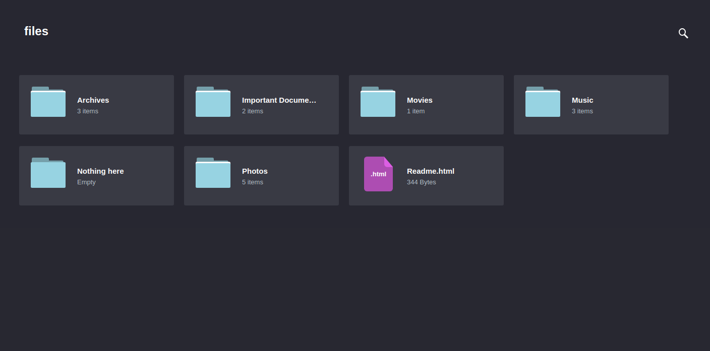

# Awesome-website-templates
Collect some awesome website temples


## [cute-file-browser](https://tutorialzine.com/2014/09/cute-file-browser-jquery-ajax-php)  
1. Simple website template for share and download files.

    

2. Nginx + Ajax + PHP

3. **Some notes:**  
    - Modify `/etc/nginx/sites-enabled/default` to connect with php backend.
    - Modify `/etc/php5/fpm/pool.d/www.conf` to listen on 9000 port which is defined in default file of previous step.
        ```
        ;listen = /var/run/php5-fpm.sock
        listen = 9000      
        ```
    - Modify php.ini to avoid to output warning messages. To locate php.ini:
        ```
        php5 -i|grep php.ini
        ```
    - Need to modfity user(www-data) or target files and folders permission when symbolic links are used.
        ```
        sudo chmod 755 symbolic-link
        ```